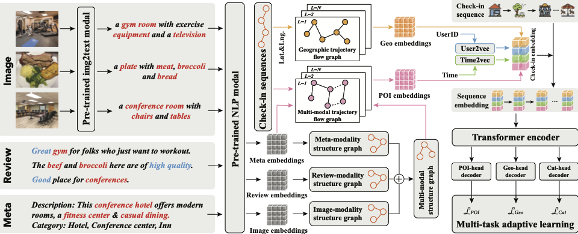

# MMPOI

This is the pytorch implementation of paper "MMPOI: A Multi-Modal Content-Aware Framework for POI Recommendation"




## Train

- Download dataset from https://drive.google.com/file/d/17FbNvkO74xub6AeT2fpm938qDqUDB-04/view?usp=sharing.

- Unzip NYC.zip to dataset/.

- Run `build_graph.py` to construct the sequence graphs from the training data.

- Train the model using python `train.py`. All hyper-parameters are defined in `param_parser.py`


## Citation

```
Under review.

```

